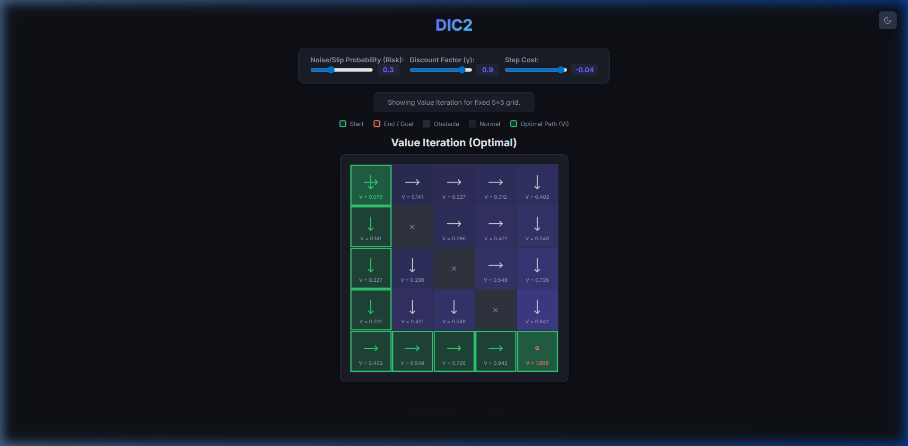

# DIC2 — Grid World Value Iteration

[](https://gridworlddic2.vercel.app/)

An interactive reinforcement learning visualization tool focused on the **Value Iteration** algorithm. This project demonstrates finding the optimal policy in a stochastic Markov Decision Process (MDP) setting within a grid-based environment.



## 🚀 Live Demo
Visit the live application at: [https://gridworlddic2.vercel.app/](https://gridworlddic2.vercel.app/)

## 📝 Project Summary
This application is a streamlined solver for the 5x5 Grid World problem using the **Value Iteration** algorithm. It illustrates how a reinforcement learning agent converges on an optimal policy by iteratively updating state values based on the Bellman Optimality Equation. 

The UI is designed to be **non-interactive regarding grid setup**, providing a fixed "Golden Scenario":
- **Start**: (0,0) | **Goal**: (4,4)
- **Obstacles**: (1,1), (2,2), (3,3)
- **Automatic Execution**: Calculations run instantly on page load.

Users can dynamically adjust **Noise**, **Gamma**, and **Step Cost** to observe real-time strategy shifts and path changes.

## 🛠️ Key Features
- **Value Iteration Implementation**: High-precision calculation of $V$ values and $\pi^*$ policy.
- **Visual Path Highlighting**: The optimal trajectory is automatically traced and highlighted in green.
- **Dynamic Parameter Tuning**: Real-time updates via sliders for environmental constants.
- **Premium Aesthetics**: Clean dark/light mode interface with glassmorphism elements.
- **Top-Right Theme Toggle**: Quick access to dark/light mode.

## 💻 Tech Stack
- **Backend**: Python / Flask (Serverless ready)
- **Frontend**: Vanilla JS, HTML5, CSS3
- **Deployment**: Optimized for Vercel

## 🏃 Getting Started Locally

### 1. Prerequisites
Ensure you have Python installed. Install the dependencies:
```bash
pip install flask gunicorn
```

### 2. Run the Application
Navigate to the project directory and run:
```bash
python api/index.py
```

### 3. Access the Grid
Open your browser and go to: [http://127.0.0.1:5000](http://127.0.0.1:5000)

## 📖 How It Works
1.  **Initialization**: Upon loading, the system pre-fills the 5x5 grid with specified start, end, and obstacle points.
2.  **Calculation**: The backend runs the Value Iteration algorithm until convergence.
3.  **Policy Extraction**: The optimal policy is extracted from the converged value function.
4.  **Path Tracing**: A path-tracing algorithm identifies the sequence of states from start to goal following the optimal policy.
5.  **Interactive Updates**: Adjusting the sliders in the UI will trigger an immediate re-evaluation on the server.
